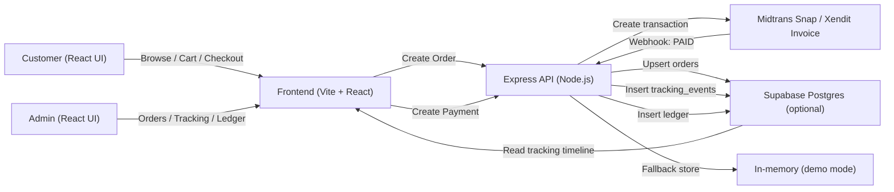

<div align="center">

<!-- Animated Wave Header -->


<!-- Typing SVG -->


<!-- Badges -->
<p>
  
  
  
  
  
  
  
  
  
</p>

<p align="center">
  Website e-commerce tanaman hias: checkout otomatis (QRIS/e-wallet/kartu/VA) + tracking lokasi pesanan real-time.
</p>

</div>

---

## Table of Contents
- [Preview](#preview)
- [Ringkasan](#ringkasan)
- [Fitur Utama](#fitur-utama)
- [Routes & Pages](#routes--pages)
- [Arsitektur & Data Flow](#arsitektur--data-flow)
- [API Endpoints](#api-endpoints)
- [Tech Stack](#tech-stack)
- [Struktur Project](#struktur-project)
- [Installation & Setup](#installation--setup)
- [Konfigurasi Mapbox](#konfigurasi-mapbox)
- [Setup Payment Gateway](#setup-payment-gateway)
- [Setup Database Supabase](#setup-database-supabase)
- [Keamanan](#keamanan)
- [Deployment](#deployment)
- [Contributing](#contributing)
- [License](#license)

---

## Preview

> Tambahkan screenshot/gif ke folder `./assets/` lalu update path di bawah agar README terlihat makin “premium”.

| Home | Checkout | Tracking |
|---|---|---|
| `assets/preview-home.png` | `assets/preview-checkout.png` | `assets/preview-tracking.png` |

Contoh embed (gantikan file-nya sesuai assets kamu):
```md

```

---

## Ringkasan

**Azka Garden v2** adalah website e-commerce tanaman hias dengan:
- 🛒 katalog + cart + checkout
- 💳 pembayaran otomatis via **Midtrans Snap** / **Xendit Invoice** (QRIS/e-wallet/kartu/VA tergantung aktivasi merchant)
- 📍 **live order tracking** berbasis Mapbox + timeline status
- 🧾 **ledger saldo** internal untuk rekonsiliasi (admin)
- 🧪 bisa jalan **demo mode** (tanpa Supabase & tanpa payment key) untuk presentasi/portfolio

---

## Fitur Utama

- 🛍️ **E-commerce**: products (demo), detail, rekomendasi, cart persisten (localStorage)
- 💳 **Pembayaran**:
  - Midtrans Snap: token + redirect (butuh `MIDTRANS_SERVER_KEY` + `VITE_MIDTRANS_CLIENT_KEY`)
  - Xendit Invoice: invoice URL + success redirect (butuh `XENDIT_SECRET_KEY`)
- 🧾 **Webhook**: status otomatis jadi **PAID** + ledger credit saat payment terkonfirmasi
- 📍 **Tracking**:
  - `/tracking/:orderId` menampilkan peta + lokasi terakhir + timeline status
  - admin bisa push event status + lat/lng (simulasi kurir)
- 🛡️ **Fallback demo mode**: backend punya in-memory store, frontend punya localStorage store

---

## Routes & Pages

### Customer
- `/` → Home
- `/products` → Produk
- `/products/:id` → Detail Produk
- `/cart` → Keranjang
- `/checkout` → Checkout (create order + create payment)
- `/orders/success` → Halaman sukses (return dari provider)
- `/tracking-hub` → Cari orderId untuk tracking
- `/tracking/:orderId` → Tracking detail (map + timeline)

### Admin (Demo)
- `/admin` → Admin Home
- `/admin/dashboard` → Ringkasan & KPI
- `/admin/orders` → Daftar order + push tracking event
- `/admin/payments` → Ledger saldo

---

## Arsitektur & Data Flow



> Kalau Supabase tidak diset, backend otomatis pakai **in-memory store** (reset saat server restart).

---

## API Endpoints

Base URL (default): `http://localhost:8787`

### Health
- `GET /health` → `{ "ok": true }`

### Orders
- `POST /api/orders`
```json
{
  "orderId": "AZKA-2026-0001",
  "items": [{ "id": "p1", "qty": 2 }],
  "total": 250000,
  "paymentChannel": "QRIS"
}
```

### Payments
- `POST /api/payments/midtrans/create`
```json
{ "orderId": "AZKA-2026-0001", "amount": 250000 }
```

- `POST /api/payments/xendit/create`
```json
{ "orderId": "AZKA-2026-0001", "amount": 250000 }
```

### Webhooks
- `POST /api/webhooks/midtrans`
- `POST /api/webhooks/xendit`

### Tracking
- `GET /api/tracking/:orderId` → `{ "orderId": "...", "events": [], "latest": {} }`
- `POST /api/tracking/:orderId/events`
```json
{ "status": "allocated", "description": "Kurir ditugaskan", "lat": -6.2, "lng": 106.8 }
```

### Ledger
- `GET /api/ledger` → `{ "rows": [], "balance": 0 }`

---

## Tech Stack

- **Frontend:** React 18, TypeScript 5, Vite 6, Tailwind 3, Framer Motion
- **Backend:** Node.js + Express, axios, dotenv
- **Maps:** Mapbox GL JS
- **DB (opsional):** Supabase (Postgres) + schema SQL
- **Payments:** Midtrans Snap / Xendit Invoice

---

## Struktur Project

```txt
azka-garden-modern/
├─ backend/
│  ├─ server.js                 # orders, payments, webhooks, tracking, ledger
│  └─ package.json
├─ supabase/
│  └─ schema.sql                # orders, tracking_events, ledger
├─ src/
│  ├─ pages/
│  │  ├─ admin/                 # AdminHome, Dashboard, Orders, Payments
│  │  └─ ...                    # Home, Products, Cart, Checkout, Tracking
│  ├─ lib/                      # api, cart, payments, tracking, storage, supabaseClient
│  └─ data/                     # demo products
├─ .env.example
└─ package.json
```

---

## Installation & Setup

### Prerequisites
```txt
Node.js 18+ (recommended)
npm
```

### Quick Start (Windows PowerShell)

1) Siapkan env:
```powershell
cd azka-garden-modern
copy .env.example .env
# Minimal untuk jalan: VITE_API_BASE_URL=http://localhost:8787
```

2) Jalankan backend:
```powershell
npm install --prefix backend
node backend/server.js
```

3) Jalankan frontend:
```powershell
npm install
npm run dev
```

- Frontend: `http://localhost:5173`
- Backend: `http://localhost:8787`

> Tips: kamu juga bisa pakai `npm run backend` dari root (scripts sudah tersedia).

---

## Konfigurasi Mapbox

Tracking pakai Mapbox. Isi di `.env`:
```txt
VITE_MAPBOX_TOKEN=YOUR_TOKEN
```

Kalau token kosong, halaman tracking bisa gagal render peta (untuk demo, isi token atau matikan bagian map di UI).

---

## Setup Payment Gateway

### Midtrans (Snap)

Isi `.env`:
```txt
MIDTRANS_SERVER_KEY=...
VITE_MIDTRANS_CLIENT_KEY=...
MIDTRANS_IS_PRODUCTION=false
VITE_MIDTRANS_SNAP_URL=https://app.sandbox.midtrans.com/snap/snap.js
```

Webhook URL:
```txt
https://YOUR_DOMAIN/api/webhooks/midtrans
```

### Xendit (Invoice)

Isi `.env`:
```txt
XENDIT_SECRET_KEY=...
XENDIT_WEBHOOK_TOKEN=...      # header x-callback-token
FRONTEND_BASE_URL=https://YOUR_FRONTEND_DOMAIN
```

Webhook URL:
```txt
https://YOUR_DOMAIN/api/webhooks/xendit
```

> Untuk testing webhook lokal, gunakan tunnel seperti ngrok/Cloudflared lalu set webhook URL dari dashboard payment.

---

## Setup Database Supabase

Supabase bersifat **opsional**.

1) Jalankan SQL di `supabase/schema.sql` pada project Supabase kamu  
2) Isi `.env`:
```txt
# Frontend (optional)
VITE_SUPABASE_URL=...
VITE_SUPABASE_ANON_KEY=...

# Backend (server-side only)
SUPABASE_URL=...
SUPABASE_SERVICE_ROLE_KEY=...
```

> **Service Role Key** hanya untuk backend. Jangan taruh di frontend.

---

## Keamanan

- **Midtrans:** verifikasi `signature_key` (SHA512).  
  Dev-only bypass: `MIDTRANS_SKIP_SIGNATURE=true` (JANGAN di production).
- **Xendit:** verifikasi header `x-callback-token` (set `XENDIT_WEBHOOK_TOKEN`).
- **Supabase:** kunci service role hanya di backend.

---

## Deployment

- **Frontend:** Vercel / Netlify / static hosting
- **Backend:** Render / Railway / VPS
- Pastikan webhook URL **HTTPS** dan env production sudah benar.

---

## Contributing

```bash
1. Fork repository
2. git checkout -b feature/awesome
3. git commit -m "feat: awesome"
4. git push origin feature/awesome
5. Open Pull Request
```

---

## License

Belum ada file `LICENSE` di zip ini.  
Kalau mau open-source, tambahkan `LICENSE` (mis. MIT) dan update badge.
