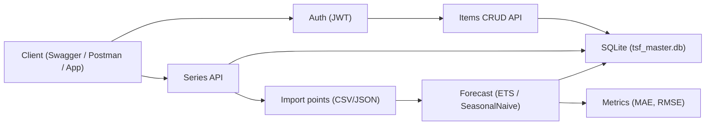

<div align="center">

<!-- Animated Wave Header -->


<!-- Typing SVG -->


</div>

---

## 🧭 Table of Contents
- [✨ What you get](#-what-you-get)
- [🚀 Quick start](#-quick-start)
- [🧠 Data flow](#-data-flow)
- [🧪 API at a glance](#-api-at-a-glance)
- [📦 Storage & konfigurasi](#-storage--konfigurasi)
- [🧪 Testing](#-testing)
- [🗺️ Project structure](#-project-structure)
- [🔐 Security notes](#-security-notes)
- [📌 Roadmap](#-roadmap)

---

## ✨ What you get

### ✅ Master CRUD template (resource: `items`)
- Bulk ops, filtering, sorting, pagination (page/size + cursor)
- Projection `select=` + include/expand `include=category,tags`
- Lifecycle: soft-delete/restore/archive + purge
- Workflow/actions (submit/approve/publish/verify/dll)
- Idempotency, optimistic locking (ETag), audit logs
- Import/Export **CSV / XLSX / PDF** (CsvHelper, ClosedXML, QuestPDF)

### 📈 Time Series module (resource: `series`)
- Import points dari **CSV/JSON**
- Forecast methods:
  - **Seasonal Naive**
  - **ETS (Exponential Smoothing)**
- Simpan forecast runs + metrics **MAE** & **RMSE**

### 🛡️ Ops & reliability
- Auth JWT + refresh/session + **RBAC**
- Rate limiting (built-in)
- Outbox worker + retry/backoff + **DLQ**
- Activity logs + health checks
- Swagger docs

> Semua poin di atas berasal dari README repo (fitur & endpoint) dan konfigurasi default.  

---

## 🚀 Quick start

### 1) Prerequisites
- .NET SDK 8

### 2) Run (Windows PowerShell)
```powershell
dotnet restore
dotnet build
dotnet run --project .\src\TimeSeriesForecast.Api\TimeSeriesForecast.Api.csproj
```

Swagger UI (default):
- `http://localhost:5000/swagger`

### 3) Default admin (seeded on first run)
- Email: `admin@example.com`
- Password: `Admin123!`

### 4) Set JWT secret (recommended)
> Dev default di `appsettings.json` itu **bukan** untuk production. Set env var:

```powershell
$env:Jwt__Key="YOUR_LONG_RANDOM_SECRET"
```

---

## 🧠 Data flow



---

## 🧪 API at a glance

### Auth
- `POST /api/v1/auth/register`
- `POST /api/v1/auth/login`
- `POST /api/v1/auth/refresh`
- `GET  /api/v1/auth/sessions`
- `POST /api/v1/auth/sessions/{id}/revoke`

### Items (base: `/api/v1/items`)
Core:
- `POST /items` • `GET /items` • `GET /items/{id}` • `PUT /items/{id}` • `PATCH /items/{id}`
- `DELETE /items/{id}` (soft delete; `?force=true` untuk hard)

Bulk:
- `POST /items/bulk` • `PATCH /items/bulk` • `DELETE /items/bulk`

Import/Export:
- `POST /items/import` (CSV/JSON)
- `GET  /items/export?format=csv|xlsx|pdf`

### Time series (base: `/api/v1/series`)
- `POST /series` • `GET /series` • `GET /series/{id}` • `DELETE /series/{id}`

Points:
- `POST /series/{id}/points/import?mode=replace|append`
- `GET  /series/{id}/points?take=2000`

Forecast:
- `POST /series/{id}/forecast`
  - body contoh:
    ```json
    { "method": "ets", "horizon": 30, "holdout": 7, "alpha": 0.35, "seasonLength": 7 }
    ```
- `GET /series/{id}/forecasts`

---

## 📦 Storage & konfigurasi

Default config (lihat `appsettings.json`):
- DB: `Data Source=tsf_master.db`
- Storage root: `../../storage`
- Rate limit default: `PermitLimit=60` per `WindowSeconds=60`

> Untuk production: ganti DB ke PostgreSQL + EF migrations, dan simpan secrets via env/secret store.

---

## 🧪 Testing

```powershell
dotnet test
```

---

## 🗺️ Project structure

```text
TimeSeriesForecast.Master/
├─ src/
│  ├─ TimeSeriesForecast.Core/
│  └─ TimeSeriesForecast.Api/
├─ tests/
│  └─ TimeSeriesForecast.Tests/
├─ scripts/
│  ├─ build.ps1
│  ├─ run.ps1
│  └─ reset-db.ps1
└─ README.md
```

---

## 🔐 Security notes

- Jangan pakai `Jwt:Key` default dari `appsettings.json` untuk production.
- Pastikan endpoint admin dilindungi RBAC.
- Kalau expose ke publik, tambahkan:
  - HTTPS + reverse proxy
  - WAF/rate-limit tambahan
  - logging + monitoring eksternal

---

## 📌 Roadmap
- [ ] Forecast methods tambahan (ARIMA/Prophet/LightGBM/LSTM) *(opsional)*
- [ ] PostgreSQL + migrations
- [ ] Docker compose (API + DB)
- [ ] Background job dashboard untuk outbox/DLQ

---

<div align="center">
</div>
